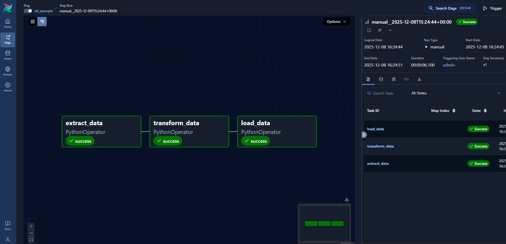
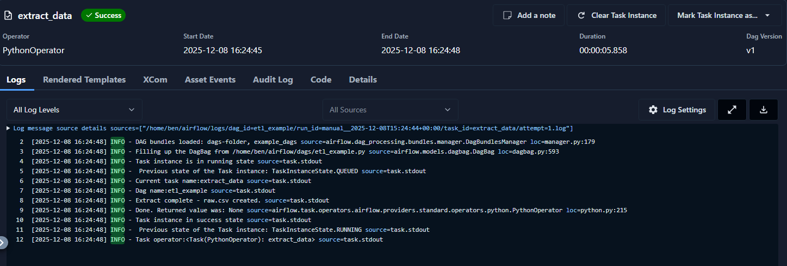
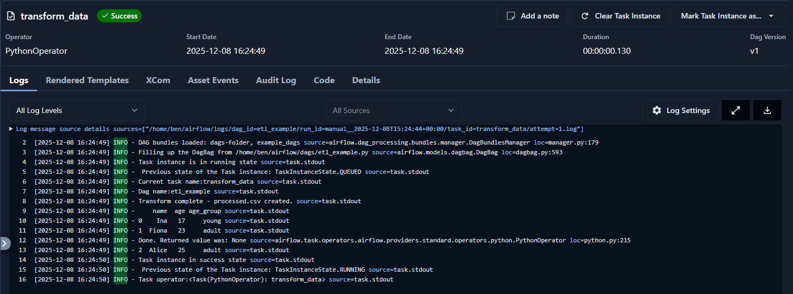
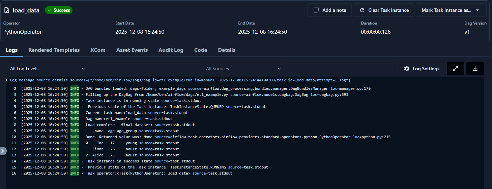

# Airflow ETL Pipeline

Dieses Projekt enthält eine einfache ETL-Pipeline mit Apache Airflow:

- Extract: erzeugt eine Beispiel-CSV
- Transform: verarbeitet Daten mit Pandas
- Load: schreibt transformierte Daten zurück

## Dateien
- dags/etl_example.py
- dags/hello_dag.py

## Voraussetzungen
- Apache Airflow 3.x
- Python 3.12
- Pandas

## Ausführen
Der DAG wird automatisch im Airflow UI angezeigt und kann dort manuell ausgeführt werden.

